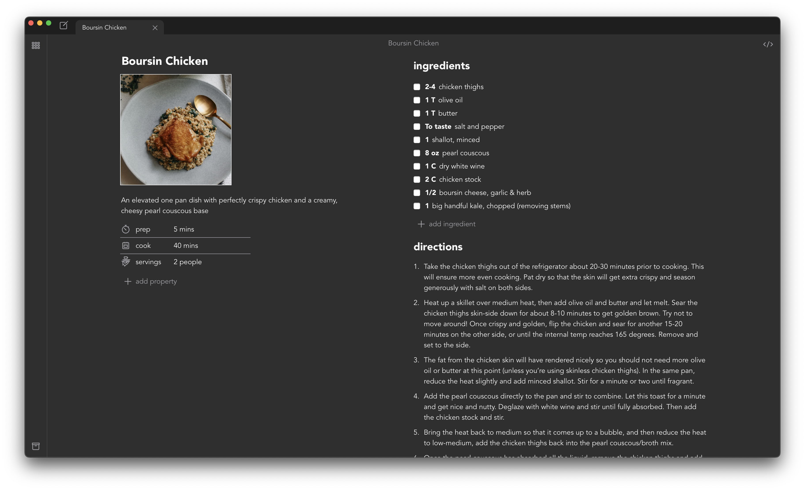

# RMS

Local-first recipe management system inspired by Obsidian. Built with Tauri, React, and Typescript in Vite.



## Disclaimer

This software is provided "as-is," without any guarantees or warranties. It is not expected to be stable or to avoid data loss. Use at your own risk.

## Getting Started

The development environment is managed using devenv.  
If you don't have devenv installed, follow the instructions [here](https://devenv.sh/getting-started/#installation).

### Mobile Development Requirements

- https://v2.tauri.app/start/prerequisites/#macos
    - Be sure Xcode application is located in `/Applications/Xcode.app`
- https://v2.tauri.app/start/prerequisites/#ios

XCode requires all dependencies to be installed in a default location.

```bash
sudo ln -s $(which pnpm) /usr/local/bin/pnpm
```

## Development

To start the Tauri development window:

```bash
make dev
```

The first time you run this command, the Rust package manager will take several minutes to download and build all the required packages. Subsequent builds will be much faster due to caching.

Once Rust has finished building, the webview will open, displaying your web app. Changes to the web app should update automatically, similar to a browser. When you update your Rust files, they are rebuilt automatically, and your app will restart.

## Recommended IDE Setup

- [VS Code](https://code.visualstudio.com/) + [Tauri](https://marketplace.visualstudio.com/items?itemName=tauri-apps.tauri-vscode) + [rust-analyzer](https://marketplace.visualstudio.com/items?itemName=rust-lang.rust-analyzer)

## Style Guide

### React Functional Components

- **Component Folder**: Create a new folder for each component. Name the folder using the component's name in lowercase, separated by hyphens (e.g., `add-filter-dialog`).

  - **Component File**: Inside the folder, create a file for the component. Name the file using PascalCase, followed by `.tsx` (e.g., `AddFilterDialog.tsx`). Export only the component from this file.

  - **Styles File**: If the component has custom styles, create a styles file named in PascalCase, followed by `.module.scss` (e.g., `AddFilterDialog.module.scss`).

- **Props Types**: If the component has any props, create a type for the props. Name the type using PascalCase, followed by `Props` (e.g., `AddFilterDialogProps`).

- **Code Grouping**: Use `// #region` and `// #endregion` to group related sections of code. This helps in collapsing and expanding sections in VS Code. The order should be:

  1. variables - simple `const` declarations
  2. contexts - `useContext` declarations
  3. states - `useState` declarations
  4. effects - `useEffect` declarations
  5. functions - `function` declarations
  6. components - `const` declarations of components

- **Inline Functions**: Use inline functions whenever possible to reduce complexity and improve readability.

- **JSDoc Comments**: Create JSDoc comments for all functions, including:
  - `@param` for each parameter
  - `@returns` for the return value
  - `@throws` for any errors that can be thrown
  - `@example` for an example of usage

## Testing

End-to-end tests are written using the [WebDriver](https://www.w3.org/TR/webdriver/) interface. Tauri supports WebDriver using [`tauri-driver`](https://crates.io/crates/tauri-driver), which is not supported for macOS. We use [WebdriverIO](https://webdriver.io/) (WDIO) test automation framework and the `@tauri-apps/api/mocks` package to write and run tests.

To run the test suite:

```bash
pnpm wdio run wdio.conf.json
```

TODO: Follow steps as mentioned [here](https://jonaskruckenberg.github.io/tauri-docs-wip/development/testing.html) to set up the test environment.

## Building

To build the Tauri app:

```bash
make build
```

## Color Palette

- **Icons**: `#EBEBF5`
